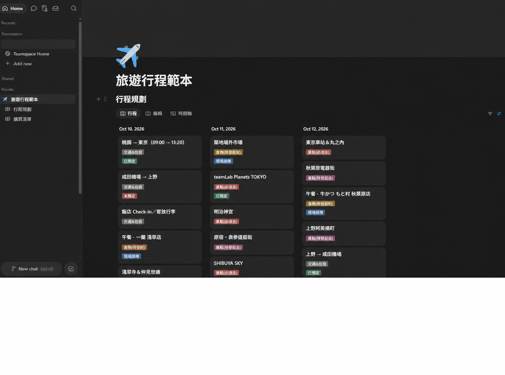
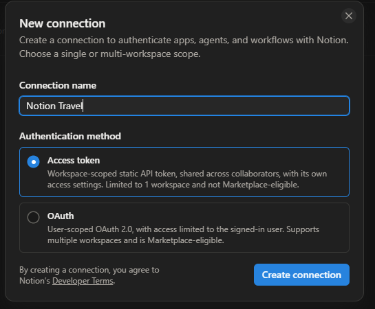
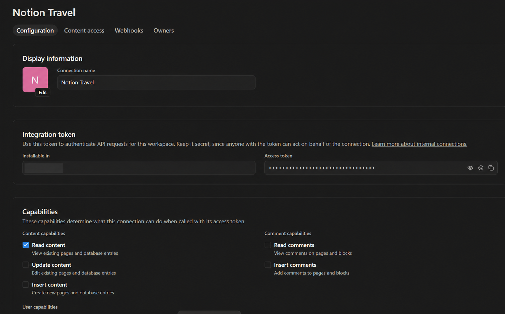
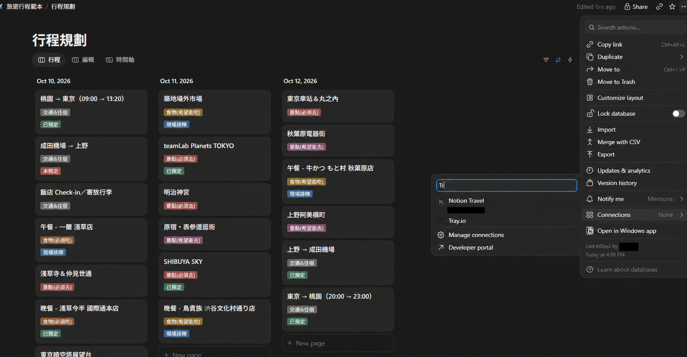
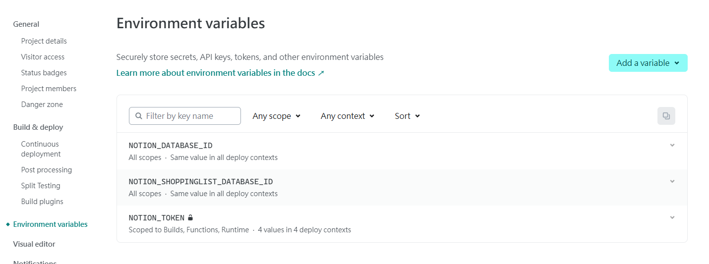
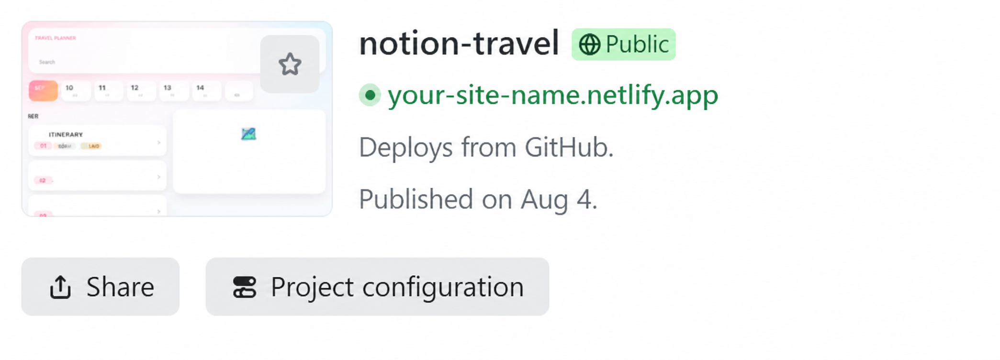
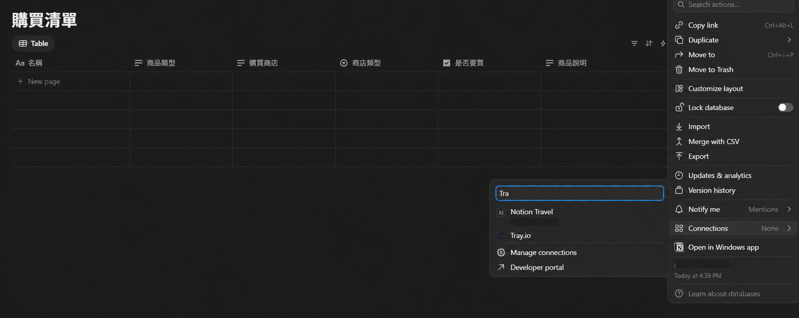
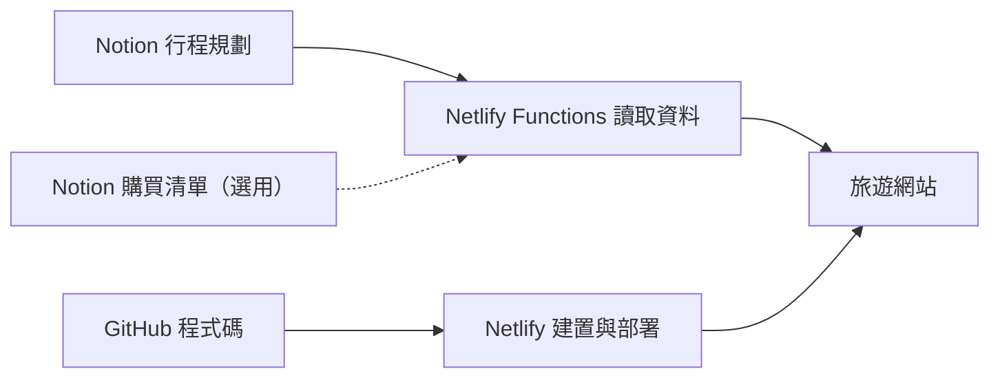

# Notion Travel

把 Notion 裡的旅遊行程，變成可以分享給旅伴查看的網站。這份說明是寫給第一次使用 GitHub、Notion 整合與 Netlify 的人；不需要會寫程式，只要依序完成每一步即可。

完成主要設定後，你會得到：

- 一個由 Notion「行程規劃」資料庫產生的旅遊網站
- 手機與電腦都能開啟的公開網址
- 在 Notion 更新內容後，網站也會讀取最新資料
- 一個可稍後再啟用的「購買清單」附屬功能

> [!IMPORTANT]
> 網站沒有登入功能。只要知道網址，就能看到你授權給網站顯示的行程資料。請不要在行程或購買清單中放護照號碼、訂位代碼、住址、電話或其他敏感資訊。

## 開始前準備

請先建立以下免費帳號。每個服務只負責一件事：

| 服務 | 這個服務會做什麼 | 建立帳號 |
| --- | --- | --- |
| Notion | 儲存與編輯行程資料 | [註冊 Notion](https://www.notion.so/signup) |
| GitHub | 保存網站程式碼；一鍵部署時也會在你的帳號建立一份副本 | [註冊 GitHub](https://github.com/signup) |
| Netlify | 把程式碼建置成網站，並提供可分享的網址 | [註冊 Netlify](https://app.netlify.com/signup) |

> [!NOTE]
> 稍後會在 Notion 建立一組只讀的 Integration Token，讓網站能讀取指定的資料庫。Token 就像密碼，不能貼在 README、GitHub、聊天訊息或網站畫面中；只需要存入 Netlify 的環境變數。

## 第 1 步：複製 Notion 公開範本

1. 登入 Notion。
2. 開啟 [Notion Travel 公開範本](https://sugar-chance-e39.notion.site/e95103e9e5d483b5b252014c3e371521)。
3. 按頁面右上角的 **Duplicate**。
4. 選擇要存放範本的 Notion 工作區。
5. 在你自己的工作區確認有兩個資料庫：**行程規劃**與**購買清單**。



> [!IMPORTANT]
> 範本已經放入展示資料。現在先不要刪除或修改它們；我們會先用展示資料確認整個網站成功上線，再回到 Notion 改成自己的旅遊行程。這樣發生問題時，比較容易判斷是設定錯誤，還是資料內容不完整。

## 第 2 步：建立 Notion 只讀連線

1. 開啟 [Notion Integrations](https://www.notion.so/profile/integrations)。
2. 按 **New connection**。
3. Connection name 填入 `Notion Travel`。
4. Authentication method 選擇 **Access token**。
5. 按 **Create connection**。



## 第 3 步：複製 Notion Token

1. 建立完成後會進入 **Configuration**。
2. 在 **Capabilities** 中只保留 **Read content**：取消勾選 **Update content** 與 **Insert content**，留言權限也全部保持未勾選。
3. User capabilities 選擇 **No user information**。
4. 回到同一頁的 **Integration token**，按右側的 Copy 圖示複製 Token；不需要先把 Token 顯示出來。
5. 暫時存放在只有你看得到的地方；第 6 步會把它貼到 Netlify。

> [!IMPORTANT]
> 設定完成後應如下圖：只有 `Read content` 被勾選，`Update content`、`Insert content` 與留言權限都保持未勾選，讓網站只能讀取資料。



> [!CAUTION]
> 不要把 Token 貼進程式碼或上傳到 GitHub。如果 Token 曾經公開，請立即回到 Notion 重新產生 Token，並同步更新 Netlify。

## 第 4 步：只授權「行程規劃」資料庫

先只連接主要功能，降低第一次設定的複雜度。購買清單會在網站成功後再處理。

1. 在 Notion 用完整頁面開啟 **行程規劃**資料庫。
2. 按右上角的 **•••**。
3. 找到 **Connections**，搜尋 `Notion Travel`。
4. 選擇剛建立的 Connection，並在 Notion 詢問時確認連接。



> [!NOTE]
> 請只授權網站確實需要的資料庫。不要為了方便而授權整個工作區。

## 第 5 步：取得「行程規劃」Database ID

1. 在 Notion 中用完整頁面開啟 **行程規劃**資料庫。
2. 按右上角的 **•••**，再按 **Copy link**。
3. 把連結貼到暫存文字中。
4. Database ID 是網址中一段 32 個字元的英文字母與數字；網址若有 `?v=`，不要把 `?v=` 及其後內容一起複製。

例如網址是：

```text
https://www.notion.so/Trip-1234567890abcdef1234567890abcdef?v=其他內容
```

Database ID 就是：

```text
1234567890abcdef1234567890abcdef
```

這個值稍後要填入 `NOTION_DATABASE_ID`。

## 第 6 步：一鍵部署到 Netlify

按下方按鈕：

[](https://app.netlify.com/start/deploy?repository=https://github.com/roy55688/notion-travel#NOTION_TOKEN=&NOTION_DATABASE_ID=)

> [!NOTE]
> 這個按鈕要等本 Repository 設為 Public 後才能讓其他人使用。

1. 如果 Netlify 要求登入，建議選擇使用 GitHub 登入。
2. Netlify 會請你在 GitHub 建立這個專案的副本；Repository 名稱可以保留預設值。
3. 填入兩個環境變數：

   | 變數名稱 | 要填入的內容 |
   | --- | --- |
   | `NOTION_TOKEN` | 第 3 步複製的 Notion Token |
   | `NOTION_DATABASE_ID` | 第 5 步取得的「行程規劃」Database ID |

4. 開始部署，等待 Netlify 顯示 **Published** 或部署成功。
5. 按 **Open production deploy** 或網站網址，開啟你的網站。



> [!NOTE]
> 上圖是連購物清單也設定完成後的最終狀態，所以會看到三個變數。第一次部署時只需要 `NOTION_TOKEN` 與 `NOTION_DATABASE_ID`；購物清單的變數稍後再加入。



## 第 7 步：先用展示資料確認網站成功

先不要修改 Notion。請在 Netlify 網站確認：

- 首頁能看到範本原本的行程資料
- 可以切換日期或展開行程內容
- 地圖連結與其他按鈕可以正常使用
- 重新整理頁面後仍能正常顯示

此時開啟網站的「購物清單」頁面，看到「購買清單尚未啟用」是正常的，不代表部署失敗。

如果首頁看得到展示資料，就表示 Notion、GitHub 與 Netlify 已經成功連接，可以進入下一步。

## 第 8 步：改成自己的旅遊行程

確認網站上線後，再回到 Notion 的 **行程規劃**資料庫：

1. 先修改一筆展示資料，例如行程名稱。
2. 回到網站重新整理，確認修改有顯示。
3. 確認同步正常後，再逐筆改寫或刪除其他展示資料。
4. 新增自己的日期、景點、地圖連結與備註。

網站讀取的欄位名稱與型別如下。範本已經設定完成；除非你知道程式也要一起修改，請不要重新命名或改變欄位型別。

<details>
<summary>查看「行程規劃」需要保留的欄位</summary>

| 欄位名稱 | Notion 型別 | 用途 |
| --- | --- | --- |
| `Name` | Title | 行程名稱 |
| `Time` | Date | 行程日期與時間 |
| `Order` | Number | 同一天的顯示順序 |
| `標籤` | Select | 景點、交通、住宿等分類 |
| `google map連結` | URL | 地圖網址 |
| `票券預定` | Select | 票券或預約狀態 |
| `預定時間` | Text | 補充預約時間 |
| `註解` | Text | 行程備註 |

範本中的關聯欄位可繼續保留，網站不會使用它們。

</details>

## 選用：啟用網站的「購物清單」

行程網站確認正常後，如果你也想使用購物清單，再完成以下設定。網站中的「購物清單」會讀取 Notion 的 **購買清單**資料庫；原本的 Notion Integration 與 Token 都可以繼續使用，不必重新建立。

1. 在 Notion 用完整頁面開啟 **購買清單**資料庫。
2. 按右上角 **••• → Connections**，搜尋並選擇 `Notion Travel`。
3. 再按 **••• → Copy link**。
4. 依照第 5 步的方法，取得購買清單的 Database ID。
5. 在 Netlify 開啟你的網站專案。
6. 進入 **Project configuration → Environment variables**。
7. 新增下列環境變數：

   | 變數名稱 | 要填入的內容 |
   | --- | --- |
   | `NOTION_SHOPPINGLIST_DATABASE_ID` | 「購買清單」的 Database ID |

8. 回到 **Deploys**，選擇重新部署網站。
9. 部署完成後開啟網站的「購物清單」頁面，確認範本展示資料出現。
10. 確認成功後，再回 Notion 修改或刪除購買清單的展示資料。



完成後，Netlify 的環境變數會和第 6 步的圖片一樣共有三個，不需要另外建立新的 Token。

<details>
<summary>查看「購買清單」需要保留的欄位</summary>

| 欄位名稱 | Notion 型別 | 用途 |
| --- | --- | --- |
| `名稱` | Title | 商品名稱 |
| `商品類型` | Text | 商品分類文字 |
| `商店類型` | Select | 商店分類 |
| `購買商店` | Text | 預計購買地點 |
| `商品說明` | Text | 品牌、規格或備註 |
| `是否要買` | Checkbox | 是否列入清單 |
| `已購買` | Checkbox | 是否已經買到 |

</details>

## 之後如何更新內容

網站成功後，日常使用不需要再操作 GitHub 或 Netlify：

- 新增、刪除或修改行程：直接編輯 Notion 的 **行程規劃**
- 新增或勾選商品：直接編輯 Notion 的 **購買清單**
- 網站重新整理時會讀取最新資料

## 常見問題

### 網站顯示讀取失敗或沒有行程

依序檢查：

1. Netlify 的環境變數名稱是否完全一致，沒有多餘空格。
2. `NOTION_DATABASE_ID` 是否來自 **行程規劃**，而且沒有包含 `?v=` 後面的內容。
3. **行程規劃**資料庫的 Connections 是否已加入 `Notion Travel`。
4. Token 是否仍然有效。
5. 修改環境變數後，是否重新部署網站。

可在 Netlify 的 **Deploys** 中開啟最近一次部署，查看錯誤訊息。

### 網站有開啟，但看不到某一筆行程

- 確認該筆資料仍在 **行程規劃**資料庫內。
- 確認 `Name` 與 `Time` 有填寫。
- 確認 `Time` 的型別仍是 Date。
- 重新整理網站後再檢查。

### 網站的購物清單顯示「尚未啟用」

這是正常狀態。若要使用，完成上方「選用：啟用網站的購物清單」即可；不需要購物清單時可以維持原狀。

### 購買清單已設定，但仍然沒有資料

- 確認 **購買清單**資料庫的 Connections 已加入 `Notion Travel`。
- 確認 `NOTION_SHOPPINGLIST_DATABASE_ID` 沒有貼錯。
- 確認環境變數新增後已重新部署。
- 確認 Notion 欄位名稱與型別沒有被修改。

### 修改 Notion 後，網站沒有立刻更新

先重新整理網站。資料可能有短暫快取，請稍候一會再試；如果仍未更新，再檢查 Netlify Functions 的記錄。

### Token 不小心公開了

立即回到 Notion Integration 的 **Configuration** 重新產生 Token，再把新 Token 更新到 Netlify 並重新部署。不要只刪除公開文字，因為舊 Token 可能已經被複製。

## 資料如何運作

完成前面的實作後，如果想了解各服務之間的關係，可以參考這張圖：



## 進階使用

### 情境一：Fork 後用 Codex 或 Claude Code 客製網站

這個流程適合想保留自己的程式碼版本、讓 AI 協助修改，並在每次更新 GitHub 後由 Netlify 自動部署的人。

#### A. Fork 並連接 Netlify

1. 在 GitHub 開啟本專案，按右上角 **Fork**。
2. 選擇自己的帳號並建立 Fork。
3. 登入 Netlify，選擇 **Add new project → Import an existing project**。
4. 選擇 GitHub，授權 Netlify 讀取你的 Fork。
5. 選擇 `notion-travel` Repository。
6. 建置設定會由專案內的 `netlify.toml` 自動提供，通常不需要修改。
7. 加入 `NOTION_TOKEN` 與 `NOTION_DATABASE_ID`；需要購買清單時，再加入 `NOTION_SHOPPINGLIST_DATABASE_ID`。
8. 開始部署並確認網站能顯示 Notion 的展示行程。

#### B. 把程式碼下載到電腦

先安裝 Git，再在 PowerShell 或 Terminal 執行。請把 `YOUR-USERNAME` 換成自己的 GitHub 使用者名稱：

```powershell
git clone https://github.com/YOUR-USERNAME/notion-travel.git
cd notion-travel
git switch -c codex/my-change
```

第一次使用 `git clone`；之後要取得 GitHub 上的新版本，在專案資料夾執行 `git pull` 即可。

#### C. 交給 AI 協助修改

- **Codex**：在 Codex App 選擇這個資料夾，或在專案資料夾執行 `codex`。可先閱讀 [Codex CLI 官方入門說明](https://learn.chatgpt.com/docs/codex/cli)。
- **Claude Code**：依照 [Claude Code 官方安裝說明](https://code.claude.com/docs/en/getting-started)安裝，再於專案資料夾執行 `claude`。

請清楚描述想改的畫面或功能，並要求 AI 在修改後執行測試。AI 完成後，不要直接上線；先檢查：

```powershell
git status
git diff
```

確認內容符合預期後，再提交到自己的分支：

```powershell
git add <修改過的檔案>
git commit -m "說明這次修改"
git push -u origin codex/my-change
```

> [!CAUTION]
> 不要把 `.env`、Notion Token 或任何密碼交給 AI 寫進程式碼。Token 只應存在本機 `.env` 或 Netlify 環境變數中。

#### D. 用 Deploy Preview 確認後再上線

1. 在 GitHub 用剛推送的分支建立 Pull Request。
2. Netlify 會為 Pull Request 建立一個 Deploy Preview 網址。
3. 開啟 Preview，實際檢查手機與電腦版畫面。
4. 確認無誤後，合併 Pull Request 到 `main`。
5. Netlify 偵測到 `main` 更新後，會自動部署正式網站。

如果原專案之後有更新，可在 GitHub Fork 頁面使用 **Sync fork**。若你已修改同一批檔案，可能需要先處理合併衝突。

參考：[GitHub Fork 官方說明](https://docs.github.com/en/pull-requests/how-tos/work-with-forks/fork-a-repo?tool=webui)、[Netlify Deploy Previews](https://docs.netlify.com/deploy/deploy-types/deploy-previews/)。

### 情境二：在本機開發與測試

<details>
<summary>展開本機開發流程</summary>

#### 環境需求

- Node.js 20.19 以上，或 22.12 以上
- Netlify CLI

#### 建立本機環境變數

在專案根目錄執行：

```powershell
Copy-Item .env.example .env
```

編輯 `.env`：

```dotenv
NOTION_TOKEN=你的_Notion_Integration_Token
NOTION_DATABASE_ID=行程規劃_Database_ID
NOTION_SHOPPINGLIST_DATABASE_ID=購買清單_Database_ID
```

`NOTION_SHOPPINGLIST_DATABASE_ID` 是選用項目。不使用購買清單時可以留空。

#### 安裝並啟動

```powershell
npm install --prefix frontend
npx netlify-cli dev
```

Netlify Dev 會讀取根目錄的 `.env`，並同時啟動前端與 Functions。

#### 執行檢查

```powershell
npm test --prefix frontend
npm run lint --prefix frontend
npm run build --prefix frontend
node --test --test-isolation=none netlify/tests/notion.test.js netlify/tests/page.test.js netlify/tests/shopping.test.js
```

</details>

## 安全提醒

- 不要把 Notion Token 上傳到 GitHub。
- Notion Integration 只開啟讀取權限，並且只授權需要的資料庫。
- 網站網址預設是公開的，不要在 Notion 放敏感資料。
- 使用 AI 修改後，先檢查 `git diff`，再提交與部署。

## 官方參考資料

- [Notion：複製公開頁面](https://www.notion.com/help/duplicate-public-pages)
- [Notion：建立 Internal integration](https://developers.notion.com/guides/get-started/create-a-notion-integration)
- [Notion：Integration 權限](https://developers.notion.com/reference/capabilities)
- [Netlify：Deploy to Netlify 按鈕](https://docs.netlify.com/deploy/create-deploys/#deploy-to-netlify-button)
- [Netlify：環境變數](https://docs.netlify.com/build/environment-variables/get-started/)

## 圖像來源

PWA 圖示取自 Vincent van Gogh 於 1888 年創作的《Langlois Bridge at Arles》，使用 Wikimedia Commons 的 [`Vincent Willem van Gogh 027.jpg`](https://commons.wikimedia.org/wiki/File:Vincent_Willem_van_Gogh_027.jpg)。該檔案頁標示原畫與數位重製品均為全球 Public Domain；本專案使用的版本曾透過 Codex 裁切並調整為 192×192 與 512×512。

社群分享預覽圖 `frontend/public/og-image.png` 為本專案透過 Codex 原創製作，未使用第三方圖片素材。

## 授權

本專案採用 [MIT License](LICENSE)。
